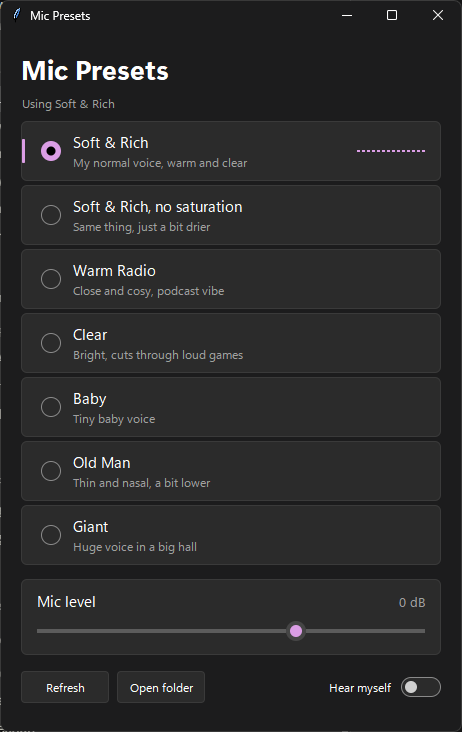

# mictest

Small Windows app I use to switch between my Equalizer APO voice presets in one click, with a live mic meter and a "hear myself" toggle.



```
1. install Equalizer APO and VB Audio Virtual Cable
2. copy the presets folder into C:\Program Files\EqualizerAPO\config
3. put the VST plugins the presets use (TDR Kotelnikov, GForm, Airwindows Density3 etc) in EqualizerAPO\VSTPlugins
4. double click "Mic Preset Switcher.pyw" (needs Python 3.12 or newer)
```
